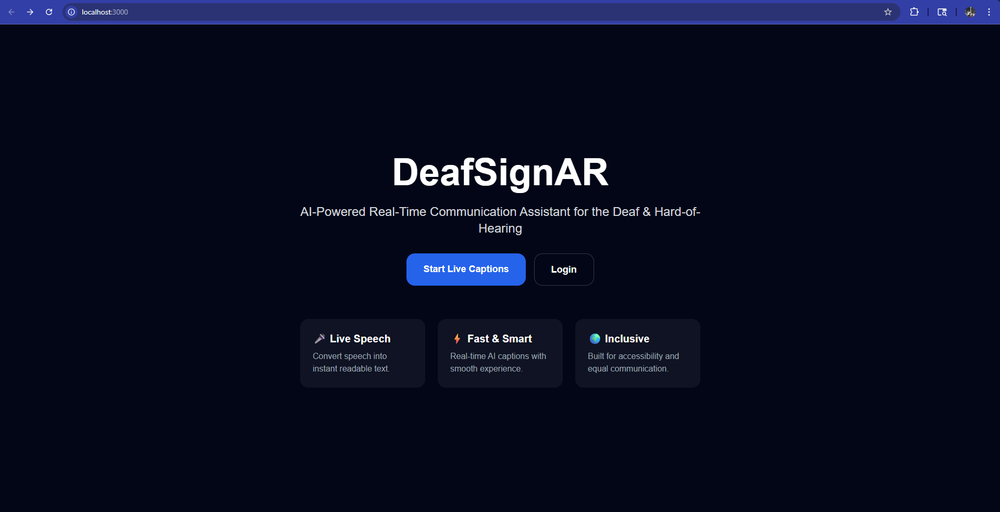
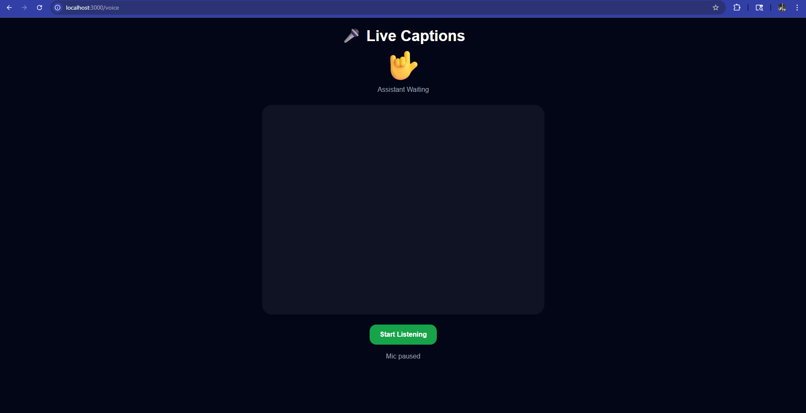
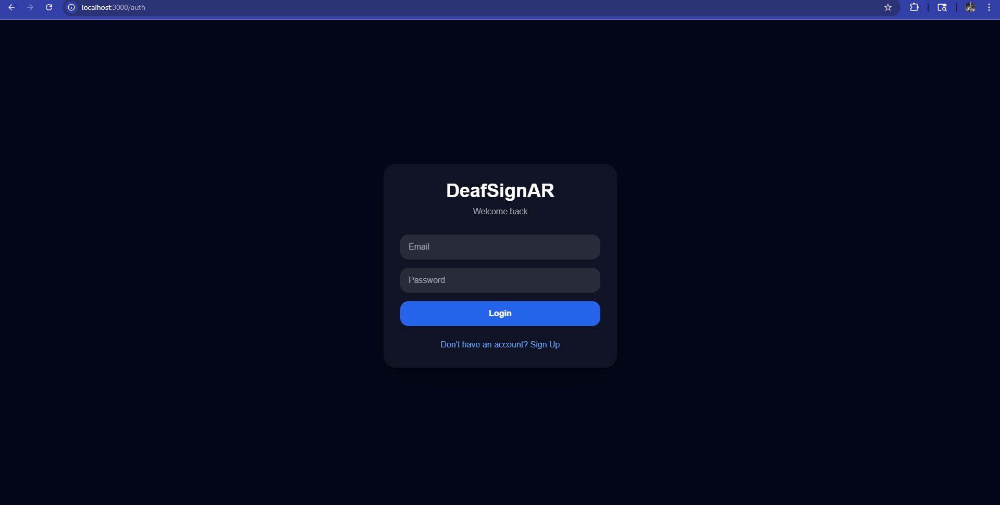

# 🎤 DeafSignAR

A real-time voice-to-sign assistant that converts speech into live captions and emoji-based sign reactions, with optional voice replies.

---

## 🚀 Overview

DeafSignAR is an accessibility-focused web application that listens to speech in real time, converts it into text, and maps key words into visual emoji-based sign representations. It also supports a simple conversation mode where the system can respond using voice synthesis.

---

## ✨ Features

- 🎤 Real-time speech recognition (Web Speech API)
- 💬 Live captions display
- 🤟 Emoji-based sign mapping
- 🔊 Voice response using Speech Synthesis API
- 🧠 Basic conversation mode (voice in → voice out)
- 📱 Clean responsive UI (React + Tailwind)

---

## 🧠 How It Works

1. User speaks into microphone  
2. Speech is converted to text  
3. Keywords are detected from the text  
4. Matching emoji/sign is displayed  
5. System generates a response and speaks it back (optional)

---

## 🛠️ Tech Stack

- React + TypeScript  
- Web Speech API  
- Speech Synthesis API  
- Tailwind CSS  

---

## 📦 Installation

```bash
git clone https://github.com/ajingeorge2007/DeafSignAR.git
cd DeafSignAR_Full
npm install
npm start
```

---

## 💡 Future Improvements

- 🤖 AI-powered intent detection (NLP / OpenAI integration)
- 🧏 Real sign language avatar animations
- 🌐 Multi-language support
- 📱 PWA mobile version
- 🎭 Emotion-aware assistant mode

---

## 🎯 Purpose

Built as an accessibility and communication tool to bridge spoken language with visual sign representation in real time.

---

## Screenshots







## 👨‍💻 Developer

Ajin George
